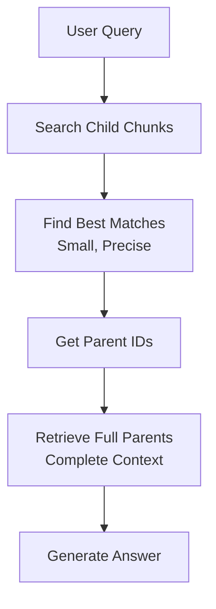

# Understanding Parent-Child RAG Architecture in Your NVIDIA Course Assistant

## Table of Contents
1. [The Core Problem](#the-core-problem)
2. [Parent-Child Theory](#parent-child-theory)
3. [Your Implementation](#your-implementation)
4. [Data Flow Architecture](#data-flow-architecture)
5. [Why This Works](#why-this-works)

---

## The Core Problem

Traditional RAG (Retrieval-Augmented Generation) systems face a fundamental challenge:

### The Chunking Dilemma
- **Small chunks** (100-200 tokens): Great for precise search, but lack context
- **Large chunks** (1000+ tokens): Provide context, but poor search accuracy

**Example Problem:**
```
Query: "What prerequisites do I need for MobilityGen?"

Small chunk found: "...course uses Isaac Sim and ROS 2..."
→ Missing the actual prerequisites!

Large chunk found: [2000 tokens about 5 different courses]
→ Too much noise, inefficient!
```

---

## Parent-Child Theory

The Parent-Child retriever pattern solves this elegantly by **separating search from retrieval**:

### The Key Insight
> "Search with precision, retrieve with context"

### How It Works



### The Two-Layer Structure

#### 1. Child Chunks (Search Layer)
- **Purpose**: Semantic search targets
- **Size**: 512 characters
- **Content**: Focused snippets
- **Example**:
  ```
  "Learning Objectives:
  - Configure a custom robot in Isaac Lab
  - Design reinforcement learning tasks
  - Develop reward functions"
  ```

#### 2. Parent Documents (Context Layer)
- **Purpose**: Complete information
- **Size**: ~2000-3000 characters
- **Content**: Full course details
- **Example**:
  ```
  # Train Your Second Robot in Isaac Lab
  Level: Technical - Intermediate
  Duration: 2 Hours

  ## About This Course
  [full description...]

  ## Learning Objectives
  [all objectives...]

  ## Prerequisites
  You should complete: isaac-lab-003

  ## Next Steps
  After this course, consider: [advanced courses...]
  ```

---

## Your Implementation

### 1. Manual JSON Structure
Your `nvidia_courses_template.json` preserves relationships:

```json
{
  "courses": [
    {
      "id": "isaac-lab-004",
      "title": "Train Your Second Robot",
      "prerequisites": ["isaac-lab-003"],
      "leads_to": [],
      "description": "Full course description...",
      "learning_objectives": [...],
      "skills_taught": [...]
    }
  ]
}
```

**Why Manual Collection Was Smart:**
- Preserved visual relationships from PDF
- Captured prerequisite arrows
- Maintained learning paths
- Added web-scraped details

### 2. Database Structure

Your SQLite schema implements the parent-child pattern:

```sql
-- Flat course data
CREATE TABLE courses (
    id TEXT PRIMARY KEY,
    title TEXT,
    description TEXT,
    ...
)

-- Parent documents (full context)
CREATE TABLE parent_documents (
    id INTEGER PRIMARY KEY,
    course_id TEXT,
    content TEXT  -- Complete course information
)

-- Child chunks (search targets)
CREATE TABLE child_chunks (
    id INTEGER PRIMARY KEY,
    parent_id INTEGER,  -- Links to parent
    content TEXT,       -- Small searchable piece
    FOREIGN KEY (parent_id) REFERENCES parent_documents(id)
)
```

### 3. The Import Process

```python
# json_importer.py workflow
For each course in JSON:
    1. Insert flat data → courses table
    2. Build parent document:
       - Combine: description + objectives + prerequisites + skills
       - Create comprehensive context
       - Store in parent_documents
    3. Chunk parent into children:
       - Split into 512-char pieces
       - Maintain parent_id reference
       - Store in child_chunks
```

---

## Data Flow Architecture

### Query Processing Pipeline

```
User: "What prerequisites do I need for Isaac Sim?"
                    ↓
1. EMBEDDING PHASE
   Query → "What prerequisites..." → [0.23, -0.15, 0.87, ...]
                    ↓
2. SEARCH PHASE (Child Chunks)
   Vector similarity search in 122 chunks
   Finds: chunk_47: "Prerequisites: Basic Python..."
         chunk_89: "Before Isaac Sim, complete..."
                    ↓
3. PARENT RETRIEVAL
   chunk_47 → parent_id: 3 → Full Isaac Sim course
   chunk_89 → parent_id: 3 → (same parent)
                    ↓
4. CONTEXT BUILDING
   Parent Document 3:
   "# Getting Started with Isaac Sim
    ...
    Prerequisites: None (beginner friendly)
    Leads to: isaac-sim-002, isaac-sim-003
    ..."
                    ↓
5. GENERATION (Ollama)
   Prompt: "Based on context, answer: What prerequisites..."
   Answer: "Isaac Sim (isaac-sim-001) is beginner-friendly
           with no prerequisites required..."
```

### Why Each Component Matters

| Component | Purpose | Your Implementation |
|-----------|---------|-------------------|
| **Child Chunks** | Enable precise semantic search | 512-char chunks from course content |
| **Parent Documents** | Provide complete context | Full course info including prerequisites |
| **Vector Store** | Fast similarity search | Chroma DB with sentence embeddings |
| **Parent Map** | Quick parent lookup | Dictionary: parent_id → content |
| **Embeddings** | Convert text to searchable vectors | all-mpnet-base-v2 (768 dimensions) |

---

## Why This Works

### 1. **Precision + Context**
- Search finds the exact relevant section (child)
- Retrieval provides the complete picture (parent)

### 2. **Relationship Preservation**
Your manual JSON capture preserved:
- Prerequisites chains: `isaac-lab-001 → isaac-lab-002 → isaac-lab-003`
- Learning paths: Beginner → Intermediate → Advanced
- Cross-references: Related courses and skills

### 3. **Efficient Retrieval**
```python
# Instead of searching 19 large documents:
Search 122 small chunks → Find 4 best → Retrieve 2 parents

# Result: Fast, accurate, contextual
```

### 4. **Question-Answering Success**

**Example Query Analysis:**
```
Q: "What do I need before taking MobilityGen?"

Step 1: Child chunks matching "MobilityGen" + "need before"
        → Finds chunks mentioning prerequisites

Step 2: Retrieve parent for MobilityGen course
        → Gets FULL course context

Step 3: Answer includes:
        - Direct prerequisites
        - Recommended background
        - Related courses
        - Complete learning path
```

### 5. **The Parent-Child Advantage**

| Traditional RAG | Parent-Child RAG |
|----------------|------------------|
| Search = Retrieval | Search ≠ Retrieval |
| Compromise on chunk size | Optimal for both |
| Loses relationships | Preserves full context |
| Prerequisites scattered | Prerequisites included |

---

## Practical Benefits

### Your System Achieves:
1. **Accurate Search**: Small chunks match query intent
2. **Complete Answers**: Full parent context for comprehensive responses
3. **Relationship Awareness**: Prerequisites and learning paths intact
4. **Efficient Processing**: Only retrieve what's needed
5. **Scalability**: Works well from 20 to 2000 courses

### Real-World Impact:
```
Without Parent-Child:
"Isaac Sim teaches simulation" (fragment)

With Parent-Child:
"Isaac Sim (isaac-sim-001) is a beginner-friendly course requiring no
prerequisites. It teaches robot simulation fundamentals over 1.5 hours
and leads to advanced courses like isaac-sim-002 (Asset Ingestion) and
isaac-sim-003 (Synthetic Data Generation)."
```

---

## System Architecture Diagram

```
┌─────────────────────────────────────────────────────────┐
│                    User Question                         │
└─────────────────────┬───────────────────────────────────┘
                      │
                      ▼
┌─────────────────────────────────────────────────────────┐
│              Query Interface (CLI)                       │
└─────────────────────┬───────────────────────────────────┘
                      │
                      ▼
┌─────────────────────────────────────────────────────────┐
│              RAG Retriever                               │
│  ┌────────────────────────────────────────────────┐    │
│  │  1. Embed Query (sentence-transformers)        │    │
│  │     "prerequisites for Isaac Sim"              │    │
│  │     → [0.23, -0.15, 0.87, ...]                 │    │
│  └────────────────────┬───────────────────────────┘    │
│                       │                                  │
│  ┌────────────────────▼───────────────────────────┐    │
│  │  2. Search Child Chunks (Chroma Vector DB)     │    │
│  │     122 chunks searched                        │    │
│  │     Top 4 matches found                        │    │
│  └────────────────────┬───────────────────────────┘    │
│                       │                                  │
│  ┌────────────────────▼───────────────────────────┐    │
│  │  3. Get Parent IDs from matched chunks         │    │
│  │     chunk_47 → parent_id: 3                    │    │
│  │     chunk_89 → parent_id: 3                    │    │
│  └────────────────────┬───────────────────────────┘    │
│                       │                                  │
│  ┌────────────────────▼───────────────────────────┐    │
│  │  4. Retrieve Parent Documents                  │    │
│  │     parent_map[3] → Full Isaac Sim course      │    │
│  └────────────────────┬───────────────────────────┘    │
└───────────────────────┼────────────────────────────────┘
                        │
                        ▼
┌─────────────────────────────────────────────────────────┐
│              Build Context                               │
│  "[Course 1 - isaac-sim-001]                            │
│   # Getting Started with Isaac Sim                      │
│   Prerequisites: None                                    │
│   Leads to: isaac-sim-002, isaac-sim-003..."            │
└─────────────────────┬───────────────────────────────────┘
                      │
                      ▼
┌─────────────────────────────────────────────────────────┐
│              Ollama LLM (qwen2:7b)                      │
│  Prompt: "Based on context, answer: [question]"         │
│  → Generates comprehensive answer                        │
└─────────────────────┬───────────────────────────────────┘
                      │
                      ▼
┌─────────────────────────────────────────────────────────┐
│              Return Answer to User                       │
└─────────────────────────────────────────────────────────┘
```

---

## Database Schema Visualization

```
┌──────────────────────────────────────────────────────────────┐
│                         courses                               │
│  ┌────────────────────────────────────────────────────────┐  │
│  │  id: isaac-sim-001                                     │  │
│  │  title: Getting Started with Isaac Sim                │  │
│  │  description: ...                                      │  │
│  │  level: Technical - Beginner                          │  │
│  │  duration: 1.5 Hours                                   │  │
│  └────────────────────────────────────────────────────────┘  │
└───────────────────────┬──────────────────────────────────────┘
                        │
        ┌───────────────┴───────────────┐
        │                               │
        ▼                               ▼
┌──────────────────────────┐   ┌──────────────────────────┐
│   parent_documents        │   │   child_chunks            │
│  ┌────────────────────┐  │   │  ┌────────────────────┐  │
│  │ id: 3              │  │   │  │ id: 47             │  │
│  │ course_id:         │  │   │  │ parent_id: 3       │  │
│  │   isaac-sim-001    │  │   │  │ content: "Learn... │  │
│  │ content: [FULL     │◄─┼───┼──│ chunk_index: 0     │  │
│  │   course info      │  │   │  └────────────────────┘  │
│  │   ~2500 chars]     │  │   │  ┌────────────────────┐  │
│  └────────────────────┘  │   │  │ id: 48             │  │
└──────────────────────────┘   │  │ parent_id: 3       │  │
                               │  │ content: "Prereq...│  │
                               │  │ chunk_index: 1     │  │
                               │  └────────────────────┘  │
                               │  ┌────────────────────┐  │
                               │  │ ...more chunks     │  │
                               │  └────────────────────┘  │
                               └──────────────────────────┘
```

---

## Key Insights

### The "Goldilocks Solution"
The genius of Parent-Child RAG is that it solves the "Goldilocks problem" of chunking - instead of finding the "just right" chunk size, it uses TWO sizes optimized for different purposes: small for search accuracy, large for answer completeness.

### Why Manual JSON Collection Mattered
Automated PDF parsing would have treated the course catalog as flat text, losing:
- Arrow relationships between courses
- Visual learning path diagrams
- Prerequisite chains
- Multi-column layouts showing parallel paths

Your manual approach preserved the **semantic structure** that makes intelligent course recommendations possible.

### Performance Characteristics
- **Search space**: 122 small chunks (fast)
- **Context retrieval**: 2-4 parent documents (comprehensive)
- **Database**: SQLite (~1MB for 18 courses)
- **Embeddings**: 768-dimensional vectors
- **Query time**: ~2-3 seconds (including LLM generation)

---

## Summary

The Parent-Child RAG pattern in your system creates a **two-tier retrieval system**:

1. **Child chunks** act as precise search targets
2. **Parent documents** provide complete context
3. **Your manual JSON** preserved the course relationships that automated parsing would have lost
4. **The database structure** maintains these relationships through foreign keys
5. **The retrieval process** leverages both layers for optimal results

This architecture ensures that when someone asks about prerequisites, learning paths, or course relationships, they get **complete, accurate, contextual answers** - not fragments.

---

## References

- [LangChain Parent Document Retriever](https://python.langchain.com/docs/modules/data_connection/retrievers/parent_document_retriever)
- [Chunking Strategies for RAG](https://www.pinecone.io/learn/chunking-strategies/)
- [Advanced RAG Techniques](https://www.anthropic.com/research/retrieval-augmented-generation)

---

**Created**: 2025
**Project**: NVIDIA Course Learning Assistant
**Architecture**: Parent-Child RAG with SQLite + Chroma + Ollama